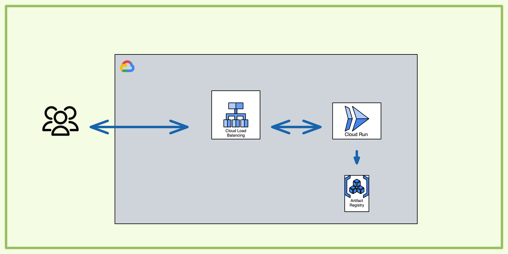

# hello-world-cloud-run

This solution use CloudRun to deploy a simple nodejs containerized "Hello World" app.  
The container is accessible from an external https load balancer.

## Solution Design

The infrastructure is composed by the following resources:

- A cloud Run service that accepts traffic from the internet only through the external Application Load Balancer. Direct requests to the **run.app** URL from the internet are not allowed.
- An external https load balancer that has the Cloud Run configured as its serverless NEG backend




## Pre-requisites

Run the [setup.sh](setup.sh) script to install all the required APIs

```bash
chmod +x setup.sh
./setup.sh
```

## Deploying the infrastructure with Terraform

cd into the Infrastructure folder and run the following commands

```bash
terraform init
terraform plan 
terraform apply
```

## Delete resources and clean project

In your Infrastructure folder run  

```bash
terraform destroy
```
